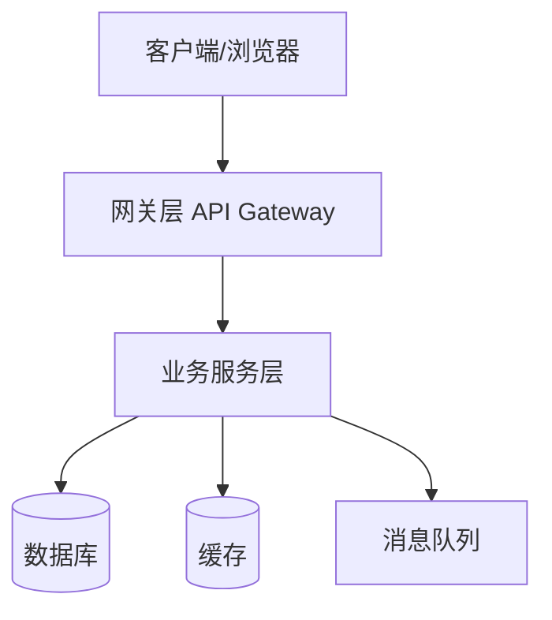
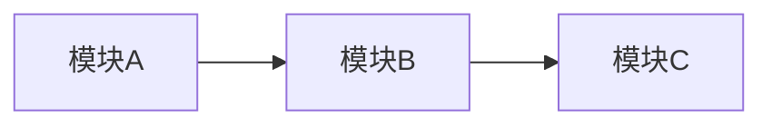

# Code Wiki — 项目代码知识库

> **文档状态说明**：本仓库当前为初始模板仓库（仅包含 `README.md` 的 hello-world 引导内容），尚无实际业务源代码、构建配置与依赖声明。
> 本文档作为 **Code Wiki 模板** 提供完整的章节结构与填写规范，待项目代码入库后，请按各章节指引逐步补充真实内容。
> 所有以 `▶️ TODO` 标记的小节均为待填充占位。

---

## 目录

1. [项目概述](#1-项目概述)
2. [项目整体架构](#2-项目整体架构)
3. [目录结构](#3-目录结构)
4. [主要模块职责](#4-主要模块职责)
5. [关键类与函数说明](#5-关键类与函数说明)
6. [依赖关系](#6-依赖关系)
7. [配置说明](#7-配置说明)
8. [项目运行方式](#8-项目运行方式)
9. [测试](#9-测试)
10. [部署与发布](#10-部署与发布)
11. [常见问题（FAQ）](#11-常见问题faq)
12. [贡献指南](#12-贡献指南)

---

## 1. 项目概述

### 1.1 项目简介

▶️ TODO：用 2–3 句话描述项目的目标、解决的问题及面向的用户群体。

**示例**：本项目是一个基于 React + Node.js 的在线协作白板应用，支持多人实时绘图、文字标注与历史版本回溯，面向远程团队的头脑风暴场景。

### 1.2 技术栈

▶️ TODO：列出项目使用的核心技术与版本。

| 类别 | 技术 | 版本 |
|------|------|------|
| 前端框架 | — | — |
| 后端语言/框架 | — | — |
| 数据库 | — | — |
| 缓存/消息队列 | — | — |
| 构建工具 | — | — |
| 部署/容器 | — | — |

### 1.3 术语表

▶️ TODO：列出项目中的关键术语、缩写及其含义。

| 术语 | 含义 |
|------|------|
| — | — |

---

## 2. 项目整体架构

### 2.1 架构概览

▶️ TODO：用文字或架构图描述系统的整体分层与组件划分。

**建议**：可使用 Mermaid 绘制架构图，示例：



### 2.2 分层说明

▶️ TODO：说明每一层的职责边界。

| 层级 | 职责 | 关键模块 |
|------|------|----------|
| 表现层 | — | — |
| 业务层 | — | — |
| 数据访问层 | — | — |
| 基础设施层 | — | — |

### 2.3 核心数据流

▶️ TODO：描述一个典型请求从入口到响应的完整流转路径。

---

## 3. 目录结构

▶️ TODO：根据实际仓库内容更新。当前仓库文件结构如下：

```
/workspace/
├── README.md          # 项目说明（当前为 GitHub hello-world 模板）
└── CODE_WIKI.md       # 本文档
```

**填写规范**：请按如下格式补充真实目录树（最多展开 3 层，过长可省略 `node_modules`、`dist`、`.git` 等目录）：

```
src/
├── api/              # 接口层
├── service/          # 业务逻辑层
├── model/            # 数据模型
├── utils/            # 工具函数
└── config/           # 配置
```

---

## 4. 主要模块职责

▶️ TODO：逐个说明各核心模块的职责、对外暴露的接口及依赖关系。

| 模块 | 路径 | 职责 | 主要依赖 |
|------|------|------|----------|
| 模块 A | `src/...` | — | — |
| 模块 B | `src/...` | — | — |

**填写规范**：每个模块建议包含以下信息：

- **职责**：该模块解决什么问题
- **关键入口**：主类或主函数
- **对外接口**：暴露给其他模块的 API
- **依赖**：依赖了哪些内部模块与第三方库
- **设计要点**：重要的设计决策

---

## 5. 关键类与函数说明

▶️ TODO：列出项目中的核心类、关键函数及其作用。

### 5.1 核心类

| 类名 | 所在文件 | 职责 | 关键方法 |
|------|----------|------|----------|
| — | — | — | — |

### 5.2 关键函数

| 函数名 | 所在文件 | 参数 | 返回值 | 作用 |
|--------|----------|------|--------|------|
| — | — | — | — | — |

**填写规范**：对复杂函数，建议补充伪代码或调用示例。

---

## 6. 依赖关系

### 6.1 外部依赖

▶️ TODO：列出项目的第三方依赖。请依据实际的依赖清单文件（如 `package.json`、`requirements.txt`、`pom.xml`、`go.mod`、`Cargo.toml` 等）填写。

| 依赖名 | 版本 | 用途 | 引入方式 |
|--------|------|------|----------|
| — | — | — | — |

> **当前状态**：仓库中暂无任何依赖声明文件，待项目代码入库后补充。

### 6.2 内部模块依赖

▶️ TODO：描述各模块之间的依赖关系，可使用 Mermaid 图展示。



### 6.3 依赖更新策略

▶️ TODO：说明依赖版本管理与升级策略（如锁文件、版本范围约束等）。

---

## 7. 配置说明

▶️ TODO：说明项目的配置项、配置文件位置及环境变量。

### 7.1 配置文件

| 文件 | 路径 | 说明 |
|------|------|------|
| — | — | — |

### 7.2 环境变量

| 变量名 | 必填 | 默认值 | 说明 |
|--------|------|--------|------|
| — | — | — | — |

> **当前状态**：仓库暂无配置文件，待项目代码入库后补充。

---

## 8. 项目运行方式

### 8.1 环境要求

▶️ TODO：列出运行项目所需的环境与版本。

| 工具 | 最低版本 | 说明 |
|------|----------|------|
| Node.js / Python / Java / Go ... | — | — |
| 包管理器 | — | — |

### 8.2 安装依赖

▶️ TODO：填写实际的依赖安装命令。

```bash
# 示例（请替换为项目实际命令）
# npm install
# pip install -r requirements.txt
```

### 8.3 本地启动

▶️ TODO：填写本地开发启动命令。

```bash
# 示例
# npm run dev
# python main.py
```

### 8.4 构建

▶️ TODO：填写生产构建命令及产物输出位置。

```bash
# 示例
# npm run build
```

### 8.5 验证

▶️ TODO：说明如何验证服务已正常启动（访问地址、健康检查接口等）。

> **当前状态**：仓库无可运行的源代码与构建配置，待项目代码入库后补充上述步骤。

---

## 9. 测试

### 9.1 测试框架

▶️ TODO：说明使用的测试框架与测试分层（单元测试、集成测试、E2E 测试等）。

### 9.2 运行测试

```bash
# 示例
# npm test
# pytest
```

### 9.3 测试覆盖率

▶️ TODO：说明覆盖率要求与统计方式。

> **当前状态**：仓库暂无测试代码，待项目代码入库后补充。

---

## 10. 部署与发布

▶️ TODO：说明项目的部署方式、CI/CD 流程与发布规范。

### 10.1 部署方式

- ▶️ TODO：容器化（Docker / K8s）/ 静态托管 / 虚拟机 ...

### 10.2 CI/CD

- ▶️ TODO：使用的 CI 平台、流水线触发条件与产物

### 10.3 发布流程

1. ▶️ TODO：版本号规则
2. ▶️ TODO：发布前检查项
3. ▶️ TODO：回滚方案

---

## 11. 常见问题（FAQ）

▶️ TODO：收集开发与运行过程中的常见问题及解决方案。

| 问题 | 解决方案 |
|------|----------|
| — | — |

---

## 12. 贡献指南

▶️ TODO：说明代码提交规范、分支策略与 PR 流程。

### 12.1 分支策略

- `master` / `main`：生产分支
- `develop`：开发分支
- `feature/*`：功能分支
- `hotfix/*`：紧急修复分支

### 12.2 提交规范

▶️ TODO：参考 Conventional Commits 规范，说明 `feat`、`fix`、`docs`、`refactor` 等类型的使用规则。

### 12.3 PR 流程

1. Fork 仓库并创建功能分支
2. 提交代码并通过测试
3. 发起 Pull Request，描述变更内容与影响范围
4. Code Review 通过后合并

---

## 附录

### A. 文档维护说明

- 本文档随项目代码同步更新，代码变更涉及架构、模块、接口、依赖、运行方式时，须同步更新本 Wiki。
- 建议在每个 `▶️ TODO` 处替换为真实内容，并移除该标记。

### B. 变更记录

| 日期 | 版本 | 变更内容 | 维护人 |
|------|------|----------|--------|
| 2026-09-26 | v0.1 | 初始创建 Code Wiki 模板（仓库尚为 hello-world 模板状态） | — |
